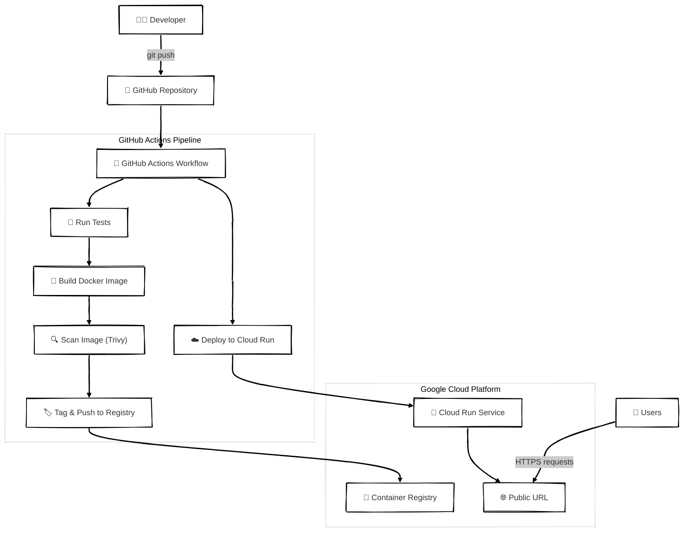

# 🚀 Google Cloud Run, GitHub Actions y Mermaid son claves en tu estrategia DevOps

HOLA DEVOPS
Demo: despliegue continuo a Cloud Run sirviendo una app React estática con NGINX.

## Diagrama (Mermaid)

### Combinación de Google Cloud Run + GitHub Actions + Mermaid ofrece:

* Menores costos operativos gracias al modelo serverless de Cloud Run
* Automatización y seguridad en despliegues con GitHub Actions.
* Documentación viva y clara con Mermaid.

En un mundo donde la velocidad de entrega y la eficiencia económica son claves, esta tríada se convierte en un estándar recomendado para cualquier equipo DevOps moderno.
